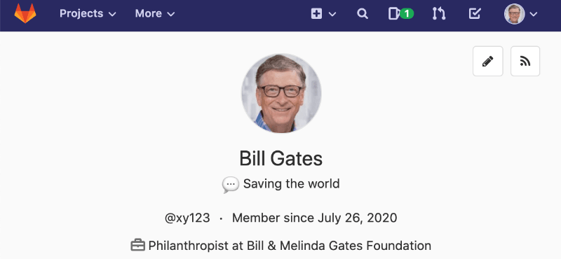

# Set Full Name On HdM GitLab



Wer seinen Namen im GitLab der HdM ändert, behält ihn leider nicht für lange. Die Hochschule hat einen Cronjob eingerichtet, der euren Namen wieder mit eurem im Studienbüro hinterlegten bürgerlichen Namen überschreibt.

Viele betrachten dies als einen Eingriff in ihre Privatsphäre, Verstoß gegen die Datenschutzgrundverordnung oder sogar Diskriminierung gegen Personen, die sich nicht als sich selber identifizieren.*

Wer dieser Maßnahme der HdM entgegen wirken möchte, kann diese Node.js App als eigenen Cronjob einstellen. Die App wird sich bei jedem Aufruf in euren GitLab Account einloggen und euren Namen mit eurem gewünschten Namen überschreiben.

_* Hierbei handelt es sich um eine Vermutung und keine tatsächlich durchgeführte Meinungsumfrage._

## Getting Started

1. `git clone https://github.com/mg98/set-name-on-hdm-gitlab`
2. `cd set-name-on-hdm-gitlab`
3. `cp .env.example .env`
4. Öffne die Datei `.env` und setze die entsprechenden Werte.

### Using Node.js

5. `npm install`
6. `npm start`

Der Befehl aus Schritt 6 kann regelmäßig als Cronjob ausgeführt werden.

**Achtung:** Special Characters müssen mit einem `\` escaped werden.

Alternativ können die Parameter als Argumente an das CLI übergeben werden. Die App wird Umgebungsvariablen, wenn sie gesetzt sind, allerdings immer bevorzugen.

```bash
node src/index.js --username=xy123 --password="DeinPassword123\$" --name="Dein Wunschname"
```

### Using Docker

5. `docker build --tag set-name-on-hdm-gitlab .`
6. `docker run -it set-name-on-hdm-gitlab`

Der Befehl aus Schritt 6 kann regelmäßig als Cronjob ausgeführt werden.

### Deploy as Serverless Function (empfohlen!)

Dieses Projekt beinhaltet auch ein fertiges Setup um die Funktion als planmäßig auszuführende Serverless-Funktion in AWS Lambda bereitzustellen.

5. `npm install`
6. `npm run deploy`

Wenn auf dem System AWS Credentials hinterlegt sind, wird dieser Befehl eine Lambda-Funktion in der AWS Cloud erstellen. Die Funktion wird automatisch alle 15 Minuten ausgeführt.

Die genaue Provisionierung kann in `serverless.yml` eingsehen und konfiguriert werden. Durch Anpassungen sollten auch Deployments zu anderen Cloud-Anbietern möglich sein. Siehe [https://www.serverless.com/framework/docs/providers/](https://www.serverless.com/framework/docs/providers/).

## Command Line Options

- `username` _(string)_: Dein HdM-Kürzel
- `password` _(string)_: Dein HdM-Password
- `fullname` _(string)_: Dein gewünschter "Voller Name"
- `browser` _(boolean, default: false)_: Ausführung der App mit Chromium
